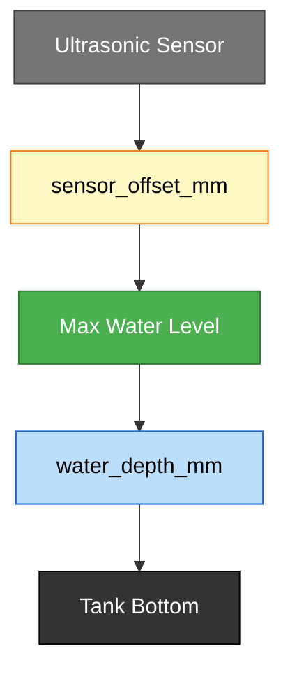

# ESPHome Tank Sensor Templates

Reusable ESPHome templates for ultrasonic tank level monitoring with optional BME280 (temperature/humidity/pressure). Designed for flexible hardware: any ESP32 variant, customizable pins, geometry, and deep-sleep timings.

## Features

- **Ultrasonic A02YYUW**: distance-to-water-height conversion with derived volume & percentage sensors.
- **Optional BME280**: temperature, pressure, humidity (include via separate package if needed).
- **Fully parameterized**: pins, tank geometry, ADC calibration, deep sleep via substitutions.
- **No secrets in repo**: all sensitive data reference `!secret` values.
- **Examples included**: ready-to-use tank configs.

## Quick Start

### 1. Create a tank config in ESPHome

In Home Assistant ESPHome UI or your local `esphome/` folder, create a new file (e.g., `my_tank.yaml`):

```yaml
substitutions:
  name: my_tank
  friendly_name: My Tank

  # Board & framework
  board: esp32-s3-devkitc-1

  # Deep sleep
  run_duration_s: 63
  sleep_duration_s: 300        # 5 minutes in seconds

  # UART pins for A02YYUW
  uart_tx_pin: GPIO17
  uart_rx_pin: GPIO18
  uart_baud_rate: 9600

  # Battery ADC
  adc_pin: GPIO04
  adc_multiplier: 4.237
  adc_attenuation: "12db"

  # Tank geometry (unquoted ok; runtime init handles typing)
  water_depth_mm: 2040
  sensor_offset_mm: 90      # height of sensor above full water surface
  capacity_liters: 2500

  # I2C for BME280 (if using one)
  i2c_sda_pin: GPIO06
  i2c_scl_pin: GPIO07
  bme280_address: "0x76"

esp32:
  board: ${board}
  variant: ESP32S3
  framework:
    type: arduino

logger:

api:
  encryption:
    key: !secret api_encryption_key

ota:
  password: !secret ota_password

wifi:
  ssid: !secret wifi_ssid
  password: !secret wifi_password
  fast_connect: true

packages:
  base: github://AHoran/esphome-templates/templates/tanksensor_base.yaml@v0.1.3
  # Uncomment only if this tank has BME280:
  # climate: github://AHoran/esphome-templates/templates/optional_bme280.yaml@v0.1.3
```

### 2. Ensure secrets are set

In your `secrets.yaml`:

```yaml
wifi_ssid: "Your WiFi SSID"
wifi_password: "Your WiFi Password"
ota_password: "Your OTA password"
api_encryption_key: "Your 32-byte base64 encryption key"
```

### 3. Flash & Monitor

```bash
esphome run my_tank.yaml
esphome logs my_tank.yaml
```

## Customization

### Pins

Override any pin in `substitutions`:

```yaml
substitutions:
  uart_tx_pin: GPIO1
  uart_rx_pin: GPIO2
  adc_pin: GPIO3
  i2c_sda_pin: GPIO8
  i2c_scl_pin: GPIO9
```

### Tank Geometry

Adjust for your physical setup:

```yaml
substitutions:
  water_depth_mm: 1800       # Maximum water depth
  sensor_offset_mm: 120      # Sensor distance above full surface
  capacity_liters: 1500      # Total tank capacity
```

**Measurement Diagram:**



**How to measure:**
- **sensor_offset_mm**: Distance from sensor mounting point down to the max/full water level
- **water_depth_mm**: Distance from max water level down to tank bottom
- **capacity_liters**: Total tank capacity at full level
- **Distance Reading**: Ultrasonic sensor measures from sensor to current water surface
- **Water Height** (calculated): `water_depth_mm - (distance - sensor_offset_mm)`

### Deep Sleep

Customize run and sleep durations (both in seconds):

```yaml
substitutions:
  run_duration_s: 120          # Longer wake time for logging
  sleep_duration_s: 600        # Sleep interval (10 minutes)
```

### Without BME280

Omit the `climate` package line if your tank doesn't have temperature/humidity sensors.

## Templates

- **[tanksensor_base.yaml](templates/tanksensor_base.yaml)**: Core ultrasonic sensor, battery ADC, and derived template sensors.
- **[optional_bme280.yaml](templates/optional_bme280.yaml)**: I2C BME280 environmental sensors (optional include).

## Notes

- **Sensor derivation**: Water height → tank volume & percentage in real-time via `on_value` lambda.
- **Battery efficiency**: ADC polls every 29s, BME280 every 30s; ultrasonic throttled to 5s average.
- **Deep sleep**: Defaults 63s run + 300s (5min) sleep. Increase `run_duration_s` if sensors need warm-up time.
- **No hardcoded secrets**: All passwords & keys use `!secret` references.
 - **Version pinning**: Use a tagged release (e.g., `@v0.1.3`) in `packages` to avoid breaking changes from `main`.
 - **Substitutions typing**: Geometry and capacity can be unquoted; the template initializes globals at runtime from substitutions. You may still quote if you prefer; both are accepted. Other numeric substitutions (e.g., `run_duration_s`, `sleep_duration_s`, `uart_baud_rate`, `adc_multiplier`) can be unquoted.

## Troubleshooting

**"File not found" errors on packages:**
- Ensure the `github://ahoran/esphome-templates/...` path matches the repo.
- ESPHome will download and cache packages automatically on first compile.

**Sensor reads `nan`:**
- Ultrasonic sensor may need a moment to stabilize; `filter_out: nan` removes stale values.
- Check UART pins are correct and sensor is powered.

**Tank % / Volume are 0 or max:**
- Verify `water_depth_mm`, `sensor_offset_mm`, and `capacity_liters` match your physical setup.
- The formula assumes: `water_height = water_depth - (distance_mm - sensor_offset)`.

## Device Classes

Published template sensors use Home Assistant device classes:
- `volume_storage`: Tank volume (L)
- Default for percentage (no specific device class in HA yet, but marked as `state_class: measurement`)

## License

MIT
